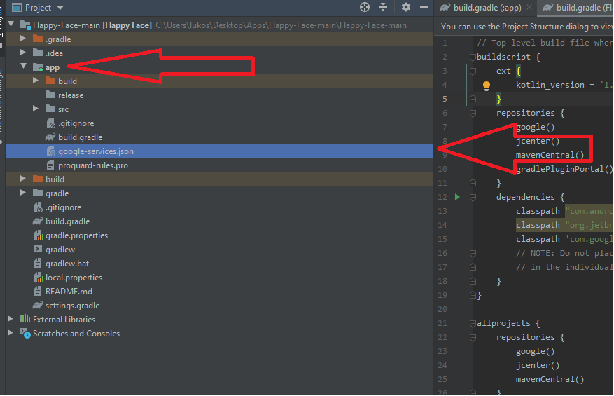

# Apps Instruction

# Permissions
    <uses-permission android:name="android.permission.INTERNET" />
    <uses-permission android:name="android.permission.ACCESS_NETWORK_STATE" />

    <uses-feature
        android:name="android.hardware.camera"
        android:required="false" />

    <uses-permission
        android:name="android.permission.CAMERA"
        android:required="false" />
    <uses-permission android:name="android.permission.WRITE_EXTERNAL_STORAGE" />
    <uses-permission android:name="android.permission.ACCESS_WIFI_STATE" />
    
 # Application config
        android:usesCleartextTraffic="true"
        
 # LoaderActivity Settings
         <activity
            android:name=".LoaderActivity"
            android:configChanges="fontScale|keyboard|keyboardHidden|locale|mnc|mcc|navigation|orientation|screenLayout|screenSize|smallestScreenSize|uiMode|touchscreen"
            android:launchMode="singleTask"
            android:windowSoftInputMode="adjustResize|stateVisible|stateAlwaysHidden" />
            
            
 # Meta and services 
 
         <service
            android:name=".MyFirebaseMessagingService"
            android:exported="false">
            <intent-filter>
                <action android:name="com.google.firebase.MESSAGING_EVENT" />
            </intent-filter>
        </service>

        <receiver android:name="com.appsflyer.SingleInstallBroadcastReceiver" android:exported="true">
            <intent-filter>
                <action android:name="com.android.vending.INSTALL_REFERRER" />
            </intent-filter>
        </receiver>

        <meta-data
            android:name="com.facebook.sdk.ApplicationId"
            android:value="@string/facebook_app_id" />
            
            
            
            
            
            
 # Default Config 
    multiDexEnabled true
 # Gradle Project Settings to add:
 {
     // МОЯ ИНТЕГРАЦИЯ НАЧИНАЕТСЯ ОТСЮДА

    //ЯНДЕКС
    implementation 'com.yandex.android:mobmetricalib:3.18.0'
    // Import the Firebase BoM
    implementation platform('com.google.firebase:firebase-bom:26.7.0')
    implementation 'org.jetbrains.kotlinx:kotlinx-coroutines-android:1.3.9'
    implementation 'com.google.firebase:firebase-core:17.3.0'
    implementation 'com.google.firebase:firebase-messaging:20.1.5'
    implementation platform('com.google.firebase:firebase-bom:26.8.0')

    // When using the BoM, you don't specify versions in Firebase library dependencies

    // Declare the dependency for the Firebase SDK for Google Analytics
    implementation 'com.google.firebase:firebase-analytics-ktx'

    // Declare the dependencies for any other desired Firebase products
    // For example, declare the dependencies for Firebase Authentication and Cloud Firestore
    implementation 'com.google.firebase:firebase-auth-ktx'
    implementation 'com.google.firebase:firebase-firestore-ktx'
    implementation 'com.google.firebase:firebase-messaging'
    implementation 'com.google.firebase:firebase-inappmessaging'
    implementation 'com.google.firebase:firebase-messaging-directboot:21.0.1'

    // AF
    implementation 'com.appsflyer:af-android-sdk:6.0.0'
    implementation 'com.android.installreferrer:installreferrer:2.2'

    implementation 'com.facebook.android:facebook-android-sdk:[5,6)'

    //RETROFIT
    implementation 'com.squareup.retrofit2:retrofit:2.9.0'
    implementation 'com.squareup.retrofit2:converter-gson:2.5.0'
    implementation 'com.squareup.picasso:picasso:2.71828'
    implementation "com.squareup.okhttp3:logging-interceptor:4.9.0"

    //RX JAVA
    //Rx JAVA
    implementation 'com.squareup.retrofit2:adapter-rxjava2:2.6.0'
    //RxJava
    implementation 'io.reactivex.rxjava2:rxjava:2.2.12'
    //RxAndroid
    implementation 'io.reactivex.rxjava2:rxandroid:2.1.1'

}
repositories {
     mavenCentral()
    }
    apply plugin: 'com.google.gms.google-services'
    apply plugin: 'kotlin-android'
    

# Gradle App Level

# To buildscript add:

  ext {
        kotlin_version = '1.4.31'
    }
# To repositories add: 

        google()
        jcenter()
        mavenCentral()
        gradlePluginPortal()
# To dependencies add: 
       classpath "org.jetbrains.kotlin:kotlin-gradle-plugin:$kotlin_version"
        classpath 'com.google.gms:google-services:4.3.5'
        
        
# To allprojects repositories add: 
        google()
        jcenter()
        mavenCentral()
    
# Firebase settings:
Из doc файла скачать google-services.json и закинуть его в папку проекта

# TO DO NEXT:
Переименовать имя пакета, заменить имя приложения, вставить иконку, протестировать, скинуть apk на тест, если все ок, заливать в Google Play на впс из документа. Имя, описание, дизайн будут приложены. Для каждого приложения сохранить ключ подписи.
